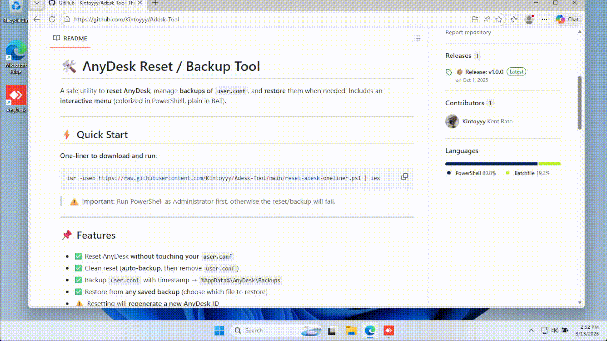

# 🛠 ɅnyDesk Reset / Backup Tool

A safe utility to **reset ɅnyDesk**, manage **backups of `user.conf`**, and **restore** them when needed.
Includes an **interactive menu** (colorized in PowerShell, plain in BAT).

---

## ⚡ Quick Start

**One-liner to download and run:**
```powershell
iwr -useb https://raw.githubusercontent.com/Kintoyyy/Adesk-Tool/main/reset-adesk-oneliner.ps1 | iex
```

> ⚠️ **Important:** Run PowerShell as Administrator first, otherwise the reset/backup will fail.

---

## 📌 Features

* ✅ Reset ɅnyDesk **without touching your `user.conf`**
* ✅ Clean reset (**auto-backup**, then remove `user.conf`)
* ✅ Backup `user.conf` with timestamp → `%AppData%\AnyDesk\Backups`
* ✅ Restore from **any saved backup** (choose which file to restore)
* ⚠️ Resetting will **regenerate a new AnyDesk ID**
* ⚠️ Saved devices will need to **re-enter the password after reset**

---

## 📂 Backup Location

All backups are stored in:

```
%USERPROFILE%\Documents\Adesk
```

Backups include:
- **user.conf** - Your AnyDesk configuration file
- **thumbnails** - Remote desktop thumbnails

Files are timestamped:

```
user.conf.YYYYMMDD-HHMMSS.bak
thumbnails.YYYYMMDD-HHMMSS.bak
```

Example:

```
user.conf.20251001-143025.bak
thumbnails.20251001-143025.bak
```

---

## 🚀 How to Run



### 🔹 PowerShell (recommended)

**Option 1: Run directly from web (fastest)**
```powershell
iwr -useb https://raw.githubusercontent.com/Kintoyyy/Adesk-Tool/main/reset-adesk-oneliner.ps1 | iex
```

**Option 2: Download & run locally**
```powershell
powershell -ExecutionPolicy Bypass -File ".\reset-adesk.ps1"
```

---

### 🔹 Batch Version (no colors)

If you prefer a **plain `.bat` tool** (simpler, no colors), run:

```bat
reset-adesk.bat
```

---

## 📜 Menu Options

When executed, you’ll see:

```
==================================================
                                                                
     _       _           _      _____           _ 
    / \   __| | ___  ___| | __ |_   _|__   ___ | |
   / _ \ / _  |/ _ \/ __| |/ /   | |/ _ \ / _ \| |
  / ___ \ (_| |  __/\__ \   <    | | (_) | (_) | |
 /_/   \_\__,_|\___||___/_|\_\   |_|\___/ \___/|_|

          ɅnyDesk Reset / Backup Tool                
==================================================

 [1] Reset ɅnyDesk (keep user.conf)
 [2] Clean Reset ɅnyDesk (backup + remove user.conf)
 [3] Backup user.conf
 [4] Restore user.conf from backup
 [5] Exit
```

---

## ⚠️ Notes

* Works only on **Windows** with AnyDesk installed in the default path.
* Always **run as Administrator** (script checks and auto-prompts if not elevated).
* A reset will **regenerate a new AnyDesk ID**.
* After reset, **Unattended Access password must be re-set**, and **all devices must re-authenticate**.
